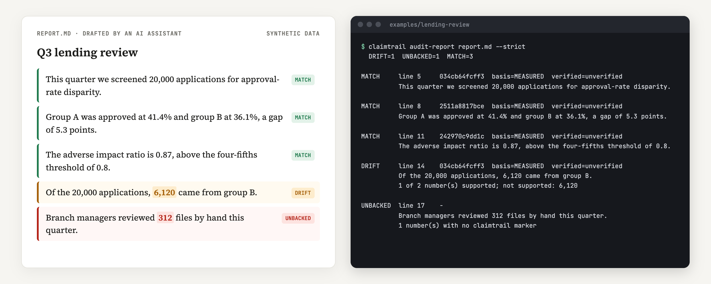

# claimtrail

Every number in a report keeps a trail back to the computation that produced it.

[](https://github.com/patrickt6/claimtrail/actions/workflows/tests.yml)
[](https://pypi.org/project/claimtrail/)
[](LICENSE)

<p align="center">
  
</p>
<p align="center"><sub>Output of <code>examples/lending-review</code> on synthetic data: one number drifted from its source and one never had a source.</sub></p>

```bash
pip install claimtrail
python examples/lending-review/run_demo.py   # from a clone: the run in the picture
```

A pipeline computes a number, someone (often an AI assistant now) writes it
into a report, and someone else signs off. Somewhere along the way the number
gets rounded, copied from an old draft, or the data under it changes. claimtrail
records each computation, links report sentences to those records, and checks
the numbers still match. It's a SQLite file plus some JSON that you commit with
your project.

| Verdict | Meaning |
|---|---|
| `MATCH` | the sentence's numbers agree with the recorded run |
| `DRIFT` | the sentence points at a run, but a number in it doesn't match |
| `UNBACKED` | the sentence has a number and no record behind it |

`audit-report` also reports `FAIL`, `MISSING` and `ORPHAN` for failed assertions and broken markers (see `src/claimtrail/audit_report.py`).

It already caught one in my own work: the
[hmda-audit](https://github.com/patrickt6/hmda-audit) README said 5 of its 14
metrics were measured on the full file, and its own ledger says 6.

## Use it

```python
import claimtrail

@claimtrail.tracked(data_files=["csv_path"])
def approval_screen(csv_path):
    ...

approval_screen("data/applications.csv")
(run,) = claimtrail.find(function="approval_screen")
claimtrail.claim("Approval gap", claim_id="q3-gap", computation_id=run.id,
                 expect=["result.approval_gap_pts ~= 5.3 +- 0.05"])
```

Mark the sentence in your report and audit it:

```markdown
Group A was approved at 41.4% and group B at 36.1%, a gap of 5.3 points.
<!-- ct:q3-gap -->
```

```text
$ claimtrail audit-report report.md --strict
  DRIFT=1  UNBACKED=1  MATCH=3

DRIFT     line 14    6196a65747f8  basis=MEASURED  verified=unverified
          Of the 20,000 applications, 6,120 came from group B.
          1 of 2 number(s) supported; not supported: 6,120

UNBACKED  line 17    -
          Branch managers reviewed 312 files by hand this quarter.
          1 number(s) with no claimtrail marker
```

`claimtrail verify ID` re-runs a computation and logs who checked it, and it
tells you when an input file changed since the run. Results from outside
Python go in with `register_external` and get checked with `verify --against`.
For LaTeX papers there's `audit-paper`.

Try the full demo on synthetic data: `python examples/lending-review/run_demo.py`.

For a module-by-module walkthrough of the architecture, data model, and the hmda-audit story, see [docs/HOW-IT-WORKS.md](docs/HOW-IT-WORKS.md). For what backs that up (the test suite, property tests, mutation testing, and two real bugs they found), see [docs/VERIFICATION.md](docs/VERIFICATION.md).

## Check what your AI agent wrote

The decorator above needs you to mark up your own pipeline. `claimtrail watch`
needs nothing: it records every command output, file read and message in an
agent session, then checks each number in the documents the agent writes.

| Status | The number is... |
|---|---|
| traced | in a command output or a file that was read |
| stated | in something you typed |
| reported | only in text another model wrote (a subagent, a web summary) |
| near | within 5% of a source, but not equal |
| unfound | in no recorded source. That's "go look", not "false" |

```bash
pip install "claimtrail[mcp] @ git+https://github.com/patrickt6/claimtrail"
```

**Claude Code hooks.** Add this to `~/.claude/settings.json`. Use the full
path from `which claimtrail` if it isn't on the PATH that Claude Code sees.

```json
"hooks": {
  "PostToolUse":      [{"matcher": "*", "hooks": [{"type": "command", "command": "claimtrail hook"}]}],
  "UserPromptSubmit": [{"hooks": [{"type": "command", "command": "claimtrail hook"}]}]
}
```

The hook only records by default. Put an empty `.claimtrail-watch` file in a
project folder and the agent also gets told, right after it writes a document
there, which numbers it couldn't trace. Run `claimtrail watch` for a live page
at http://127.0.0.1:7171, and `claimtrail export report.md` for a single HTML
file you can send to whoever signs off.

**MCP server.** `claimtrail mcp` serves the same store to any MCP client.

```bash
claude mcp add claimtrail -- claimtrail mcp         # Claude Code
```

```json
{"mcpServers": {"claimtrail": {"command": "claimtrail", "args": ["mcp"]}}}
```

That JSON goes in `~/.cursor/mcp.json` or `claude_desktop_config.json`.
The tools:

| Tool | What it does |
|---|---|
| `check_document` | checks every number in a file and shows it on the watch page |
| `check_text` | checks a draft before it's written |
| `trace_number` | finds the source of one number, like `86%` or `1,204` |
| `record_file` | reads a data or results file and records it as a source |
| `record_note` | records pasted text; it counts as reported, never traced |
| `list_documents` | the documents checked so far |
| `export_html` | writes the shareable HTML page |

Without the hooks (Cursor, Claude Desktop), the agent calls `record_file` on
the files it used. Sources and documents match up by project folder: the
nearest folder above the file with `.git` or `.claimtrail-watch` in it. If
there isn't one, the agent passes `project_dir`. `check_text`,
`trace_number` and `record_note` always need it. Text the agent sends in itself never makes a number traced,
so it can't launder a made-up number by recording it first.

Everything stays in `~/.claimtrail/watch.sqlite` on your machine, and rows
older than 30 days get deleted. That file holds the raw text of tool outputs
and messages, so delete the folder to wipe it.

## Limits

Verifier names come from an env var or git config, so they're attribution, not
authentication. The log is hash-chained, which makes edits visible but doesn't
stop them. Number matching is pattern-based, so treat a DRIFT as "go look".

For watch, "traced" means the number showed up in some output, not that the
output was right. A number the agent prints with `echo`, or writes into a file
and then reads back, counts as traced. Small integers (0 to 10) aren't checked
because they match by chance.

## Background

The idea owes a lot to Mike's post on
[agent civilizations](https://openrig.dev/blog/agent-civilizations): failures
come from hand-offs where "the information for a good decision exists, it's
just split between them, and nobody puts it together." A number in a report is
that kind of hand-off.

claimtrail started as `qprov`, the provenance tool for my NSERC research on
q-deformed numbers. `import qprov` and old `.qprov/` stores still work.

MIT license.
