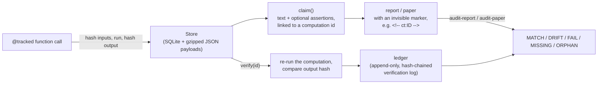

# How claimtrail works

This document explains claimtrail's design end to end: the problem, the
architecture, the data model, the CLI, and the trade-offs behind each
decision. Every claim below is tied to a file and line in this repository,
or to a command whose output is shown.

## The problem, in three sentences

A pipeline computes a number, and someone writes that number into a report.
Between the computation and the sentence, the number can get rounded,
copied from an old draft, or left stale after the underlying data changes,
and nobody notices until a reviewer catches it by hand or it ships wrong.
claimtrail records each computation as it runs, links report sentences to
those records with an invisible marker, and checks on demand that the
sentence still says what the record says.

## Architecture



The flow is one-directional up to the report, then folds back through
`verify` into the ledger, which the audit commands read to show whether a
number was ever independently re-checked.

## Sequence of one real run

This is the exact sequence used in `examples/lending-review/run_demo.py`
and described in the README: an analyst runs a screen, records three
claims, an assistant drafts a report from the screen's output, and
`audit-report` catches a number the draft invented and one with no source
at all. Running that demo end to end (`python examples/lending-review/run_demo.py`)
produces the results shown in the diagram and in the CLI section below.

```mermaid
sequenceDiagram
    participant Analyst
    participant Pipeline as "approval_screen()"
    participant Store as "claimtrail Store"
    participant Draft as "report draft"
    participant Audit as "claimtrail audit-report"

    Analyst->>Pipeline: approval_screen(csv_path)
    Pipeline->>Store: write computation row + gzipped payload
    Analyst->>Store: claim(text, computation_id, expect=[...])
    Store-->>Analyst: claim id
    Draft->>Draft: writes numbers, some copied from the run,\none invented, one with no marker
    Analyst->>Audit: claimtrail audit-report report.md --strict
    Audit->>Store: resolve each &lt;!-- ct:ID --&gt; marker
    Store-->>Audit: linked claim + computation payload
    Audit-->>Analyst: MATCH=3 DRIFT=1 UNBACKED=1
```

## Module-by-module walkthrough

Every source file under `src/claimtrail/` (plus the compatibility shim
under `src/qprov/`), in the order data moves through them.

### `tracking.py` (584 lines) - the `@tracked` decorator

The module docstring states the flow directly: "1. hash inputs *before*
the call ... 2. capture stdout/stderr/warnings during the call ... 3. on
success: hash the return value, write payload, write SQLite row ... 4. on
exception: record exception type+message+traceback, re-raise ... 5. always
return the original result" (`src/claimtrail/tracking.py:3-8`).

Key pieces:

- `tracked(...)` (`tracking.py:222-466`) is the decorator factory. It
  accepts `tags`, `name`, `data_files`, `require_data_files`, and
  `properties`.
- The computation id is built by `_make_id` (`tracking.py:154-155`):
  `id = blake2b(function_name | input_hash | code_sha)`. The docstring
  calls this the "Identity convention" and notes it makes "the same code
  on the same inputs collapse to the same row" (`tracking.py:10-12`).
- `_undeclared_file_like_params` (`tracking.py:116-140`) inspects a
  function's signature for parameters that look like file paths (suffixes
  `_path`, `_file`, `_csv`, `_json`, `_pkl`, or a `Path`/`PathLike`
  annotation) and were not listed in `data_files=[...]`. If found, it
  raises `ClaimtrailHashError` when `require_data_files=True`, or emits a
  `ClaimtrailHashWarning` otherwise. This exists because hashing a path
  *string* instead of the file's *content* is, in the module's own words,
  "the failure mode the `data_files` parameter exists to close"
  (`tracking.py:47`).
- `_Capture` (`tracking.py:158-196`) tees stdout/stderr into a buffer
  while still passing them through to the real streams, and records
  warnings. The payload keeps a transcript of what the function printed.
- Properties (an optional list of `claimtrail.properties.Property`
  objects) run after the wrapped function returns and before the row is
  written. A failed `error`-severity property raises
  `ClaimtrailPropertyError` and blocks the write entirely
  (`tracking.py:394-437`); a failed `warning`-severity property logs and
  writes anyway.

### `store.py` (1040 lines) - SQLite metadata + gzipped JSON payloads

The module docstring lays out the on-disk layout directly
(`store.py:3-12`):

```
.claimtrail/
  claimtrail.sqlite        metadata for computations, tags, claims
  payloads/
    ab/
      ab1234...json.gz   payload keyed by computation id
```

- `Store` (`store.py:293-936`) owns a SQLite connection factory and the
  payload directory. `_ensure` (`store.py:308-327`) creates the schema and
  runs `_migrate` (`store.py:329-394`) on every open, so an old store is
  upgraded in place.
- `get_store()` (`store.py:260-275`) resolves the store location in this
  order: an explicit `set_store_root()` override, the `CLAIMTRAIL_HOME`
  (or legacy `QPROV_HOME`) environment variable, the nearest ancestor
  `.claimtrail/` (or legacy `.qprov/`) directory, or `cwd/.claimtrail` as a
  last resort (`store.py:263-266`, `_resolve_store_root` at
  `store.py:278-290`).
- `write_payload` / `read_payload` (`store.py:509-559`) write canonical
  JSON, gzip it with `mtime=0` "so two machines writing identical payload
  bytes produce byte-identical .gz files" (`store.py:523-524`), and on
  read recompute the blake2b hash of the uncompressed bytes and compare it
  to the hash recorded at write time, raising `PayloadTamperedError` on a
  mismatch (`store.py:531-559`).
- `insert_computation` (`store.py:587-681`) tries a plain `INSERT` first.
  On a primary-key conflict it compares the existing row to the incoming
  row on a fixed set of identity columns (`store.py:577-585`:
  `function_name`, `function_module`, `input_hash`, `output_hash`,
  `code_sha`, `canonical_data_hash`, `payload_hash`). Identical content is
  a silent no-op; different content raises `ClaimtrailCollisionError`
  unless the caller passes `force=True`.
- `_migrate` documents the schema history directly in its docstring
  (`store.py:329-348`): v1 to v2 adds `canonical_data_hash`; v2 to v3 adds
  `payload_hash` and `output_hash_algorithm`, backfills existing rows, and
  rebuilds `claims` with `ON DELETE RESTRICT` plus a CHECK constraint; v3
  to v4 (the same file, `store.py:374-383`) adds `property_results`; v4 to
  v5 (`store.py:385-394`) adds `claims.assertions` and
  `computations.recorded_by`, and creates the `verifications` table from
  `ledger.py`.

### `claims.py` (290 lines) - recording claims and LaTeX export

- `claim(...)` (`claims.py:54-138`) registers a claim: prose text, an
  optional numeric value, an optional link to a computation, tags, and
  optional structured `expect=[...]` assertions. If a claim is tagged
  `paper=...` and has no `computation_id`, it raises
  `UnbackedPaperClaimError` unless `allow_unbacked=True` is passed
  (`claims.py:89-99`). The docstring for that error explains why: "A claim
  that ships in a paper must point to a verified computation; the
  `\provid{...}` macro in the exported LaTeX is meaningless otherwise"
  (`claims.py:43-45`).
- If `expect=[...]` is given, the claim is checked immediately against the
  linked computation's payload and refused with `ClaimAssertionError` if
  any assertion is false (`claims.py:104-119`).
- `check_claims(...)` (`claims.py:154-177`) re-evaluates every stored
  claim's assertions against its current payload; this is what
  `claimtrail check` and `claimtrail lint` call.
- `render_latex` / `export_latex` (`claims.py:233-290`) render each claim
  as a `\fact{...}` macro footnoted with `\provid{<computation id>}`.

### `assertions.py` (183 lines) - the machine-checkable half of a claim

The reason this module exists is stated in its docstring: "A claim's text is
prose ... An assertion states the same fact as a check against a field of
the linked computation's payload" (`assertions.py:3-8`). An `Expectation`
(`assertions.py:41-69`) is `path op value`, with operators
`==, !=, <=, >=, <, >, ~=, in` (`assertions.py:26`). `resolve_path`
(`assertions.py:111-123`) walks a dotted/indexed path like
`outputs.table[2].rate` through nested dicts and lists. `~=` requires a
tolerance (`~= 4.2 +- 0.05`), enforced in `Expectation.__post_init__`
(`assertions.py:50-58`).

### `audit_report.py` (397 lines) - auditing Markdown/HTML reports

Checks the documents "businesses actually circulate: a Markdown summary, a
generated HTML report, a model card, a status page" (`audit_report.py:5`),
as distinct from `audit_paper.py`, which checks LaTeX. A block of text
(paragraph, list item, table row) is linked to the store with
`<!-- ct:ID -->` in Markdown or `data-claim="ID"` in HTML
(`audit_report.py:10-16`). `split_markdown` (`audit_report.py:117-157`)
splits a document into blocks, skipping fenced code. `audit_block`
(`audit_report.py:224-296`) resolves every marker in a block, extracts the
block's numeric quantities with `extract_quantities`, and checks each one
against the linked computation's payload plus the claim's own text and
numeric value. Five statuses are defined
(`audit_report.py:53-56`): `MATCH`, `DRIFT`, `FAIL` (a structured assertion
is false), `MISSING` (the marker resolves to nothing), `ORPHAN` (resolves
to a claim with no backing computation). `strict=True` adds a sixth,
`UNBACKED`, for a block that states numbers but carries no marker at all
(`audit_report.py:34-36`).

### `audit_paper.py` (656 lines) - auditing LaTeX manuscripts

The LaTeX counterpart. `extract_provid_references`
(`audit_paper.py:150-177`) finds every `\provid{...}` in a `.tex` source
and the paragraph it sits in. `extract_numbers_from_paragraph`
(`audit_paper.py:214-259`) pulls out fractions, floats, and integers,
skipping numbers inside `\ref`, `\cite`, `\label`, and section/figure/table
references (`_SKIP_COMMAND_RE`, `audit_paper.py:59-62`;
`_SECTION_REF_RE`, `audit_paper.py:66-73`) so citation keys and equation
numbers are not mistaken for claims. `_diff_paragraph_against_payload`
(`audit_paper.py:468-525`) walks the linked computation's payload for
matching numeric leaves. The module's own caveat is explicit: "The matcher
is intentionally conservative: regex + structured payload walk, no
natural-language understanding ... a stray Mismatch is a warning, not an
error" (`audit_paper.py:24-29`). `audit_report.py` imports
`_payload_numbers` and `_resolve_provid` from this module
(`audit_report.py:49`), so the two auditors share the payload-walking
logic.

### `quantities.py` (165 lines) - reading numbers out of prose

`extract_quantities` (`quantities.py:121-162`) is the number-reader used
by `audit_report.py` (business prose, not LaTeX math). Its docstring
states the design goal directly: "Each result carries the tolerance
implied by the way the number was written: `4.2%` means a value in
`[4.15, 4.25)`, so a payload value of `4.237` or `0.04237` supports it,
while `4.3` does not" (`quantities.py:10-12`). `Quantity.matches`
(`quantities.py:94-99`) checks a stored value against every candidate
reading of the written number (a percent can be stored as `4.2` or
`0.042`, per `candidates()` at `quantities.py:84-92`). A large block-list
of regexes (`_SKIP_SPAN_RES`, `quantities.py:55-69`) excludes code spans,
markdown link targets, URLs, ISO dates, version strings, heading numbers,
list markers, ids like `M1`/`sha1`, year ranges, section signs, and fiscal
periods, so a report's incidental numbers are not mistaken for claims.

### `verify.py` (200 lines) - re-running a computation

`verify(comp_id)` (`verify.py:145-200`) looks up the row, reads its
payload, imports `function_module`, re-invokes the function with the
recorded `args`/`kwargs`, and compares the new output's hash to the stored
`output_hash`. The module docstring is explicit about failure handling:
"If the function isn't importable ... we report a clear error and abort -
we do not silently mark the computation 'unverifiable'" (`verify.py:21-23`).
On a hash mismatch, `_changed_inputs` (`verify.py:72-95`) walks the
recorded arguments for any `canonical_file` descriptor whose file content
no longer matches its recorded hash, and names it in the failure message
(`verify.py:186-197`) rather than just reporting "different output."
`verify_against(comp_id, outputs)` (`verify.py:124-142`) is the path for
computations registered with `register_external`, which have no
importable function to re-run: the caller supplies freshly produced
outputs and `verify_against` compares their hash to the record.

### `ledger.py` (247 lines) - the append-only verification log

The module docstring states the two properties that make the log useful
as evidence: "**Independence.** Each computation records who ran it
(`recorded_by`) ... **Tamper evidence.** Each entry stores the hash of the
previous entry" (`ledger.py:10-18`). `append` (`ledger.py:144-184`)
inserts one row inside `BEGIN IMMEDIATE`, chaining `entry_hash` to the
previous entry's hash (`_entry_hash`, `ledger.py:135-141`). Two SQLite
triggers refuse `UPDATE` and `DELETE` on the table
(`ledger.py:63-68`). `standing(comp)` (`ledger.py:214-236`) classifies a
computation as `independent` (a match by someone other than
`recorded_by`), `self-checked`, `author-unknown` (pre-v5 rows with no
`recorded_by`), `unverified`, or `failed` (the latest entry did not
match). The module also states its own limit plainly: "the verifier name
comes from configuration ... It is attribution, not authentication ... it
does not prevent someone with write access from rebuilding the whole
chain" (`ledger.py:20-25`).

### `inputs.py` (315 lines) - file-content fingerprints

`hash_file` (`inputs.py:47-57`) streams a file and returns its blake2b
digest. `canonical_file` (`inputs.py:60-93`) returns a dict with the
resolved absolute `path`, `name`, `size`, `mtime`, and content `sha`,
meant to be embedded as a tracked argument. `collect_data_hashes`
(`inputs.py:158-315`) walks an arbitrary input structure (dicts, lists,
tuples, sets, namedtuples, dataclasses, objects with `__dict__`, and
numpy structured arrays) looking for `canonical_file` descriptors, with a
depth limit of 16 that raises `ClaimtrailTraversalError` past that point
(`inputs.py:40-44`, `_VISITOR_MAX_DEPTH`). See "Design decisions" below
for a measured gap between this module's stated goal and its actual
behavior around `mtime`.

### `serialize.py` (232 lines) - canonical JSON

`canonical_dumps` (`serialize.py:208-215`) produces sorted-key,
no-whitespace JSON, with `{"__qprov_type__": ...}` envelopes for values
plain JSON cannot express: floats that are NaN/inf, bytes, complex
numbers, `fractions.Fraction`, Sage integers/rationals/Laurent
series/polynomials (soft-imported, `serialize.py:25-32`), and NumPy
arrays. `hash_value` (`serialize.py:222-226`) is `blake2b(canonical_dumps(value))`
with a 16-byte digest. Every hash in the system (`input_hash`,
`output_hash`, `payload_hash`, ledger `entry_hash`) is this same
construction, which is why hashes are comparable across the schema.

### `properties.py` (150 lines) and `contrib/qnumbers.py` (932 lines)

`properties.py` defines the primitive layer: `Property`
(`properties.py:66-97`, a name, a check function, a description, a
severity of `error` or `warning`) and `PropertyResult`
(`properties.py:35-63`). `ClaimtrailPropertyError`
(`properties.py:100-142`) is the exception `@tracked` raises when an
error-severity property fails. `contrib/qnumbers.py` is the one
project-specific consumer in this repo: metamorphic checks for the
q-deformed-numbers research (`check_gap_theorem`, `check_palindromicity`,
`check_recovers_mgo_eq_17_at_sqrt2`, and others,
`contrib/qnumbers.py:225-816`), each docstring citing the exact paper and
equation it enforces, for example "Source: MGO-reals Theorem 2 (gap
theorem), page 2" (`contrib/qnumbers.py:274`). `contrib/__init__.py`
(3 lines) states the intent directly: "an example of domain checks, not
part of the core" (`contrib/__init__.py:4`).

### `external.py` (149 lines) - retroactive registration

`register_external(...)` (`external.py:33-149`) folds a pre-existing JSON
result (something that never ran through `@tracked`) into the store,
using the same id convention: `blake2b(function_name | input_hash |
code_sha)`. Hardware fields are left `None` because "we don't know what
machine produced the original JSON" (`external.py:16`), and `status` is
always `"ok"` since "failures should not be retroactively registered"
(`external.py:17`).

### `gitinfo.py` (32 lines) and `hardware.py` (90 lines)

Both are soft-import, best-effort environment collectors called once per
`@tracked` call. `gitinfo.collect()` (`gitinfo.py:16-32`) returns the
current commit SHA and dirty flag via `gitpython`, or `GitInfo(None, None,
None)` if there is no repo or `git` is unavailable. `hardware.collect()`
(`hardware.py:81-90`) records hostname, CPU model, RAM, GPU model (via
`pynvml` if present), Python version, Sage version (if present), and OS.

### `query.py` (30 lines) - the programmatic query API

A thin wrapper: `get(comp_id)` (`query.py:9-11`) and `find(tags=...,
function=..., since=..., until=..., limit=50)` (`query.py:14-30`) over
`Store.get_computation` / `Store.list_computations`.

### `cli.py` (917 lines) - the `claimtrail` command

Wires every module above into 14 Click commands (`init`, `list`, `show`,
`find`, `claim`, `check`, `export-latex`, `verify`, `verifications`,
`lint`, `audit-paper`, `audit-report`, `properties`, `gc`), confirmed by
running `claimtrail --help`. The `lint` command
(`cli.py:369-541`) is the widest single check: it walks every paper-tagged
claim for `ORPHAN`/`DANGLING` links, every claim with assertions for
`ASSERTFAIL`, and every backing computation for `TAMPERED` payloads,
`ID_DRIFT` (a recomputed input hash that no longer matches the stored
one, `_check_id_drift` at `cli.py:644-671`), and `PROPFAIL`/`PROPMISSING`/
`PROPWARN` on stored property results.

### `__init__.py` (110 lines) and `src/qprov/__init__.py` (23 lines)

`claimtrail/__init__.py` is the public API surface (`tracked`, `claim`,
`find`, `get`, `verify`, `audit_report`, and so on, listed in `__all__` at
`__init__.py:64-110`) and keeps pre-rename exception names
(`QprovHashWarning` and five others, `__init__.py:56-62`) as aliases.
`qprov/__init__.py` is the compatibility shim: `import qprov` re-exports
everything from `claimtrail` and registers `sys.modules["qprov.<name>"]`
aliases for every submodule (`qprov/__init__.py:17-23`), so code written
against the pre-rename `qprov` package keeps working unchanged.

## Data model

Read directly from a live store with:

```
$ sqlite3 examples/lending-review/.claimtrail/claimtrail.sqlite ".schema"
```

### `computations` (`store.py:115-142`)

| Column | Meaning |
|---|---|
| `id` | `blake2b(function_name \| input_hash \| code_sha)`, primary key |
| `function_name`, `function_module` | what ran |
| `input_hash`, `output_hash` | canonical-JSON blake2b of inputs / return value |
| `output_hash_algorithm` | always `blake2b` today, recorded so the algorithm can change later |
| `payload_hash` | blake2b of the uncompressed payload bytes, checked on every read |
| `code_sha`, `code_dirty` | git commit and whether the working tree had uncommitted changes |
| `hostname`, `cpu_model`, `ram_gb`, `gpu_model`, `python_version`, `sage_version`, `os_info` | the machine the computation ran on |
| `runtime_seconds`, `started_at`, `ended_at` | timing |
| `status`, `error_type`, `error_message` | `ok` or `error`, with exception detail |
| `payload_path` | relative path to the gzipped JSON, so a committed store is portable |
| `canonical_data_hash` | JSON map of declared data-file names to content hashes |
| `property_results` | JSON: per-property pass/fail from the metamorphic checks |
| `recorded_by` | who ran it (env var, else git `user.email`, else `user@host`) |

### `claims` (`store.py:154-166`)

| Column | Meaning |
|---|---|
| `id` | random hex, or a caller-supplied slug, or a deterministic hash of `(text, computation_id, value_numeric)` |
| `text` | the prose claim |
| `value_numeric` | optional sortable numeric value |
| `computation_id` | `REFERENCES computations(id) ON DELETE RESTRICT` |
| `paper_tag`, `unbacked` | the `paper=` gating tag and whether the claim was explicitly staged without a computation |
| `assertions` | JSON list of structured `Expectation` checks |

A `CHECK` constraint enforces at the database level that "`paper_tag IS
NULL OR computation_id IS NOT NULL OR unbacked = 1`" (`store.py:165`): a
paper-tagged claim must either be backed or explicitly marked unbacked.

### `tags` / `claim_tags` (`store.py:144-179`)

Key/value pairs on a computation or claim, e.g. `basis=MEASURED` or
`report=q3-lending-review`.

### `verifications` (`ledger.py:45-69`)

| Column | Meaning |
|---|---|
| `seq` | autoincrement sequence number |
| `computation_id`, `verified_at`, `verifier`, `hostname`, `python_version`, `code_sha` | who checked what, where, on which code |
| `method` | `rerun` or `compare-outputs` |
| `result` | `match`, `mismatch`, or `error` |
| `prev_hash`, `entry_hash` | the hash chain; two triggers block `UPDATE`/`DELETE` on this table |

### The payload files

Each row in `computations` points to `payloads/{id[:2]}/{id}.json.gz`: a
gzipped, canonical-JSON dump of the function's arguments, captured
stdout/stderr/warnings, the source code text, and either the return value
or the exception detail (`tracking.py:475-504`). This is where the actual
result data lives; the SQLite row is metadata and a hash pointer to it.

## The CLI

Fourteen commands, confirmed against `claimtrail --help`:

```
$ claimtrail init
initialized /path/to/.claimtrail

$ claimtrail list
ID              WHEN                    FUNCTION                      STATUS  RUNTIME
--------------------------------------------------------------------------------------
d3f656b452d2    2026-09-28T14:45:14     approval_screen                ok      0.012s

$ claimtrail show d3f656b452d2 --payload
{...json metadata, then the payload...}

$ claimtrail find --function approval_screen --tag report=q3-lending-review

$ claimtrail claim "Approval gap" --link d3f656b452d2 \
    --expect 'result.approval_gap_pts ~= 5.3 +- 0.05' --tag paper=q3-lending-review
claim b9e8a915fe97 recorded

$ claimtrail check --paper q3-lending-review
ok    claim 40ca86960440  Applications screened this quarter
      result.applications == 20000 holds (actual: 20000)
all assertions hold (3 checked)

$ claimtrail export-latex --tag paper=q3-lending-review --output claims.tex
wrote claims.tex

$ claimtrail verify d3f656b452d2
OK  d3f656b452d2dd2e73919e8495ea3a27  hash=62dacfed4f81214bc775a866008f234e  logged #1 by validator@example.com

$ claimtrail verifications d3f656b452d2
   #  WHEN                  COMPUTATION   RESULT    METHOD           VERIFIER
   1  2026-09-28T14:45:14   d3f656b452d2  match     rerun            validator@example.com
standing: independent (recorded by analyst@example.com)

$ claimtrail lint
clean

$ claimtrail audit-paper paper.tex --fail-on DRIFT MISSING ORPHAN

$ claimtrail audit-report report.md --strict
claimtrail audit-report report.md
  DRIFT=1  UNBACKED=1  MATCH=3

DRIFT     line 14    40ca86960440  basis=MEASURED  verified=unverified
          Of the 20,000 applications, 6,120 came from group B.
          1 of 2 number(s) supported; not supported: 6,120

$ claimtrail properties --list
PROPERTY                                 COUNT
--------------------------------------------------

$ claimtrail gc --dry-run
nothing to gc
```

(The `list`, `claim`, `check`, `verify`, `verifications`, and
`audit-report` outputs above are copied from an actual run of
`examples/lending-review/run_demo.py`; ids and hashes will differ on a
fresh run, since `claim` mints a random id by default,
`claims.py:31-32`.)

The package also installs a `qprov` console-script alias to the same
entry point (`pyproject.toml`, `[project.scripts]`), so a script written
against the pre-rename name works unchanged.

## Design decisions and trade-offs

**Why SQLite plus gzipped JSON files, not a single database blob.** The
store docstring states the layout as fixed by design (`store.py:3-12`).
SQLite gives fast metadata queries (list, find, tag filters) without a
server; the payloads live as separate small files so a large result
(captured stdout, a long traceback, a big result value) does not bloat
row-by-row queries, and a `git diff` on the store shows which payload
files changed. `write_payload` strips the gzip member's mtime
(`store.py:523-529`) specifically so two machines writing the same
content produce byte-identical files.

**Hashing: what actually happens, and a gap between the design intent and
the code.** The core id is `blake2b(function_name | input_hash |
code_sha)` (`tracking.py:154-155`), and `input_hash` is
`hash_value({"args": ..., "kwargs": ...})` over canonical JSON
(`tracking.py:341`, `serialize.py:222-226`). For a `data_files`-declared
argument, the decorator swaps the plain path string for the full
`canonical_file(...)` dict (`inputs.py:60-93`) before hashing, and that
dict contains not just the content hash but also the resolved absolute
`path` and the file's `mtime`. The module docstrings state the intended
result is that "two machines with the same file contents under different
paths still collapse to the same computation id"
(`inputs.py:19-21`, and again at `tracking.py:245-246`). Testing that
directly (two files with byte-identical content at different paths, and
the same file with its mtime touched but content unchanged) shows the
actual result is the opposite of the stated intent: because `path` and
`mtime` are part of the hashed dict, both cases produce a *different*
`input_hash` and a different row, not the same one. Only re-running the
exact same path with an untouched mtime collapses onto the existing row.
This is a real conflict between what the docstrings say and what the code
does; the content-hash field (`sha`) inside `canonical_file` does track
content correctly and is what `verify`'s `_changed_inputs`
(`verify.py:72-95`) uses to detect a swapped file, but the *identity* of
the computation is not content-addressed the way the docs describe it.

**What "collision" means.** `ClaimtrailCollisionError`
(`store.py:85-99`) fires when an incoming row's id matches an existing
row's id but a fixed set of columns differ (`_COMP_IDENTITY_COLUMNS`,
`store.py:577-585`, which includes `output_hash` and `payload_hash` but
not the id's own inputs). Because the id itself does not depend on the
function's output, two runs of the *same inputs* through *changed code
that has not been committed* (so `code_sha` is unchanged) produce the same
id but a different `output_hash`, and the second insert raises
`ClaimtrailCollisionError`. Confirmed directly: editing a tracked
function's return value between two calls with identical arguments and an
unchanged (or absent) git SHA raises exactly this error on the second
call. The error's own message calls this "either a hash collision (rare)
or a coding bug at the call site" (`store.py:670-671`); in practice, in a
repo with git tracking enabled, the far more common trigger is editing
code without committing.

**MATCH is weaker than it looks.** `audit_block`
(`audit_report.py:224-296`) treats *any* number found anywhere in the
linked computation's payload, plus the claim's own stored text and numeric
value, as support for a number in the report (`audit_report.py:264-268`).
That payload subset includes incidental fields, such as a
`canonical_file` descriptor's `size` field or an unrelated threshold
constant, not just the number the claim is actually about. A wrong number
in the report prose can therefore MATCH by coincidence if it happens to
equal some other field in the payload, or the claim text itself. Only a
structured `--expect` assertion checks one specific field, which is why
`claimtrail check` (assertion-based) and `audit-report`
(any-number-in-payload) can legitimately disagree on the same claim.

**Number matching is tolerance-aware, not exact.** `extract_quantities`
(`quantities.py:121-162`) derives a tolerance from how a number is
written: `4.2%` tolerates `+-0.05` on the percent scale
(`_display_tolerance`, `quantities.py:102-114`), a bare integer like
`36,734,685` must match exactly. The README's own limits section states
the consequence: "Number matching is pattern-based, so treat a DRIFT as
'go look'" (`README.md`). This is a deliberate trade-off: too strict and
every rounded number in a report is a false DRIFT; too loose and a real
drift is missed.

**Why the verification log is append-only and hash-chained, not just a
timestamp column.** The `ledger.py` docstring states the two properties
this buys: independence (a check by someone other than `recorded_by`
counts differently from a self-check) and tamper evidence (each entry
hashes the previous entry, and `check_chain` detects any edit, deletion,
or reorder, `ledger.py:200-211`). The same docstring is explicit about the
limit: this does not stop someone with write access to the SQLite file
from rebuilding the whole chain from scratch; it only makes doing so
require deliberately recomputing every downstream hash, which is exactly
the kind of git history you would need to anchor externally (a commit, a
CI log) to actually catch (`ledger.py:20-25`).

**Why collisions raise instead of silently overwriting.** The pre-v3
store used `INSERT OR REPLACE` and "silently clobbered the older row"
(`store.py:92`) on an id collision. v3 changed that to raise
`ClaimtrailCollisionError` by default, with `force=True` as an explicit,
documented escape hatch that loses the older row's history
(`store.py:96-99`).

## The hmda-audit story

The claimtrail README states: "It already caught one in my own work: the
[hmda-audit] README said 5 of its 14 metrics were measured on the full
file, and its own ledger says 6" (`README.md`). This section traces that
claim to its evidence in the `hmda-audit` repository
(`github.com/patrickt6/hmda-audit`, confirmed public via `gh repo view`).

The change is commit `11849ac84d897b435ef92a7461527094a393b1e8` in that
repository, titled "Trace the README status paragraph to claimtrail
records." Its commit message states directly: "The first audit found the
README counted 5 MEASURED metrics where the ledger rows show 6; the
README now says 6" (hmda-audit commit `11849ac`). The commit's diff to
`README.md` shows the exact change: the old text read "5 MEASURED (row
counts, DuckDB-vs-pandas speed and memory at full national scale, test
count, governance controls), 6 SAMPLE_BASED (...)"; the new text reads "6
MEASURED (row counts, DuckDB-vs-pandas speed and memory at full national
scale, the full-file four-fifths screen, test count, governance
controls), 6 SAMPLE_BASED (...)" (hmda-audit commit `11849ac`, diff to
`README.md`). The added `docs/CLAIMS.md` explains the discrepancy in its
own words: "The first `claimtrail audit-report README.md` reported one
DRIFT: the README said 5 metrics were MEASURED. Counting the per-metric
rows in `results/metrics_ledger.json` gives 6 (M1, M3, M4, M5, M9, M10).
The README had left out M5, the full-file four-fifths screen, and listed
four-fifths as sample-based" (hmda-audit `docs/CLAIMS.md`).

The mechanism behind that count is `scripts/record_claims.py`'s
`register_status_counts()` function, which builds the count "from the
rows, not copied from any summary line, so a summary that disagrees with
its own table shows up as drift" (hmda-audit
`scripts/record_claims.py:58-62`), using `Counter(m["status"] for m in
ledger["metrics"])` over the per-metric entries in
`results/metrics_ledger.json`. Reading that file directly confirms six
entries with `"status": "MEASURED"`: M1, M3, M4, M5, M9, M10. The script
then states the corrected claim with a structured assertion,
`outputs.MEASURED == 6` (hmda-audit `scripts/record_claims.py:118-124`),
so a future edit that quietly reintroduces the old count of 5 would fail
`claimtrail check` rather than pass silently.

One caveat found while tracing this: `results/metrics_ledger.json` also
carries a `"counts_per_status_md"` field holding the *original* pre-fix
counts (`MEASURED: 5, SAMPLE_BASED: 6, UNMEASURABLE: 1,
PARTIALLY_FIXED_UNVERIFIED: 1`), which its own `"conflicting_count_note"`
field says is kept deliberately because it "differs from
docs/NATIONAL-NUMBERS.md's internal status table" and "both sources are
kept; they conflict" (hmda-audit `results/metrics_ledger.json`). Note also
that this pre-fix summary's four numbers (5 + 6 + 1 + 1) sum to 13, not
14; the corrected, row-derived count (6 + 6 + 1 + 1 = 14) is the one
`record_claims.py` asserts and the one the current README states. There is
no test in the claimtrail repository itself that exercises this story
(it lives entirely in the separate hmda-audit repository); this section
is sourced from that repository's git history and committed files, not
from claimtrail's own test suite.

This story is also a live illustration of a naming collision worth
flagging explicitly: hmda-audit's `results/metrics_ledger.json` (a
project-specific JSON file the author calls a "ledger" of metric status)
and claimtrail's own `ledger.py` (the append-only, hash-chained
verification log, `ledger.py:1-26`) are two unrelated meanings of the
same word. The README's "its own ledger says 6" refers to the former, not
to a `claimtrail verifications` entry.

## Glossary

- **Computation.** One recorded call, tracked live (`@tracked`) or
  registered after the fact (`register_external`). A row in
  `computations` plus a gzipped JSON payload (`store.py:189-216`).
- **Payload.** The gzipped, canonical-JSON file holding a computation's
  full inputs, captured output, source text, and stdout/stderr/warnings
  (`tracking.py:475-504`).
- **Claim.** A prose statement, optionally with a numeric value and
  optional structured assertions, optionally linked to a computation
  (`store.py:228-239`).
- **Assertion / Expectation.** A structured, machine-checkable statement
  of the form `path op value` checked against a computation's payload
  (`assertions.py:41-69`).
- **Marker.** The invisible `<!-- ct:ID -->` comment (or `data-claim="ID"`
  attribute in HTML) that links a report sentence to a claim or
  computation id (`audit_report.py:57-58`).
- **provid.** The LaTeX-side equivalent of a marker: `\provid{ID}` inside
  a `.tex` manuscript (`audit_paper.py:43`).
- **Basis.** A tag (`MEASURED`, `SAMPLE_BASED`, or a project-defined
  value) recording how a claim's number was produced; read from a
  `basis` tag on the claim or computation (`audit_report.py:29`,
  `audit_report.py:247-248`).
- **Standing.** A computation's position in the verification log:
  `independent`, `self-checked`, `author-unknown`, `unverified`, or
  `failed` (`ledger.py:97-107`).
- **DRIFT.** A number in a report or paper that the linked record does
  not support.
- **Collision.** Two computations that would share an id but have
  different content, raising `ClaimtrailCollisionError`
  (`store.py:85-99`).
- **Verification ledger.** The append-only, hash-chained table of
  `claimtrail verify` results (`ledger.py`). Distinct from a
  project-specific "results ledger" JSON file a downstream project might
  also call a ledger (see the hmda-audit section above).
- **qprov.** The project's former name. `import qprov` and a `.qprov/`
  store still work via the compatibility shim (`qprov/__init__.py`).

## Limits and what it does not do

Stated directly in the README's own "Limits" section: "Verifier names
come from an env var or git config, so they're attribution, not
authentication. The log is hash-chained, which makes edits visible but
doesn't stop them. Number matching is pattern-based, so treat a DRIFT as
'go look'" (`README.md`).

Beyond that, found while tracing the code for this document:

- The computation id is not purely content-addressed once a
  `data_files`-declared argument is involved: a file's resolved absolute
  path and mtime are part of the hashed input, not just its content (see
  "Design decisions" above). Moving a repository, or a fresh clone with a
  different mtime, can produce new rows instead of collapsing onto
  existing ones, even though the file's bytes are identical.
- `audit-report`'s MATCH status checks whether a number appears anywhere
  in the linked payload or claim text, not that it appears in the
  specific field the sentence is about. Only `--expect` assertions check
  a named field.
- `verify` requires the original function to be importable; a lambda, a
  function that has since moved or been renamed, or a Sage-only function
  defined in a `.sage` file cannot be re-run this way and reports a clear
  error rather than marking itself unverifiable (`verify.py:21-23`).
- The verification log's tamper evidence stops at the SQLite file itself;
  it does not anchor the latest hash anywhere external by default. The
  ledger docstring recommends anchoring it "somewhere you do not control
  alone (a commit, a CI log, a ticket)" when that matters
  (`ledger.py:25-26`).
- The store is explicitly single-user: "We open a fresh sqlite3 connection
  per write to avoid threading subtleties" (`store.py:11`), which is a
  design choice for simplicity, not a concurrent-write-safe system.
- LaTeX number extraction and Markdown/HTML number extraction are regex
  and pattern based, not a real parser or an LLM; both module docstrings
  describe this as intentional and conservative, favoring false negatives
  (a real drift that is missed) over false positives (a benign number
  flagged as wrong).
